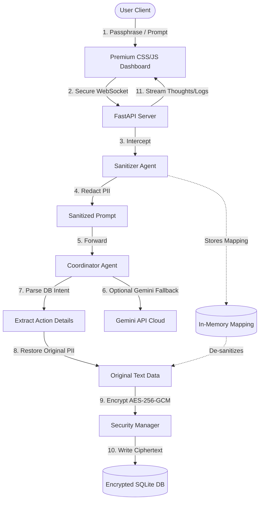

# Guardian: Privacy-First AI Agent Concierge & Encrypted Data Vault
**Kaggle Capstone Submission Writeup**

---

## 1. Executive Summary & Problem Statement

Artificial Intelligence personal concierges and workspace assistants represent the next frontier of productivity. However, these agents require access to highly sensitive, personal details: server passwords, credit card numbers, calendar events, personal contacts, and private diaries. 

### The Security Challenge
1. **Public LLM Exposure**: Sending raw user prompts directly to external LLM APIs (like Anthropic, OpenAI, or Google Gemini) leaks Personally Identifiable Information (PII) and secret keys. This compromises user privacy and violates strict compliance protocols (GDPR, HIPAA, CCPA).
2. **At-Rest Vulnerabilities**: Storing personal notes and credentials in plain text SQLite databases leaves data exposed to local threats, malware, or device theft.
3. **Complex Deployments**: Many agent systems require complex multi-container setups (separate frontend, backend, database, and socket layers), making them difficult to self-host or deploy on free cloud hosting instances.

### The Solution: Guardian
Guardian is an ultra-premium, privacy-first concierge agent system. It solves these three critical vulnerabilities by combining in-memory local encryption, a multi-agent sanitization pipeline, and a custom Model Context Protocol (MCP) server, packaged in a single-service container.

---

## 2. Technical Architecture

Guardian employs a local-first, zero-trust architecture designed to keep the user's data confidential at all stages of interaction.

### Components
1. **Premium Web Dashboard**: A single-page application styled using CSS glassmorphism, responsive grids, and real-time status pulses. It displays three panels: Concierge Console (chat), Secure Vault State (decrypted widgets and lists), and Security Guard (redaction and system logs).
2. **FastAPI Web Service**: The unified backend hosting both REST endpoints (for vault statistics) and an asynchronous WebSocket channel to stream agent thoughts step-by-step.
3. **Security Sanitizer Agent**: Intercepts the user's prompt, running regular expressions to parse and redact emails, phone numbers, SSNs, credit card numbers, and API credentials. It maintains a temporary, local, in-memory mapping to restore them later.
4. **Coordinator Agent**: Receives the sanitized prompt (ensuring the external LLM never sees PII), resolves the database intent, executes local database queries, and formats natural language responses.
5. **Security Manager (AES-256-GCM)**: Derives a 256-bit key from the user's passphrase using PBKDF2 (10,000 iterations). It encrypts database values before write and decrypts them on read.

---

## 3. Course Concepts Demonstration

Guardian demonstrates four core technical concepts from the AI Agents Intensive course:

### Concept A: Agent & Multi-Agent Systems (ADK)
Guardian uses a cooperative multi-agent pipeline:
- **Sanitizer Agent**: Enforces the security perimeter by scrubbing inputs.
- **Coordinator Agent**: Orchestrates database tool execution and processes natural language logic.
The agents communicate via structured telemetry logs, streaming their chain-of-thought (CoT) and warnings in real-time.

### Concept B: Model Context Protocol (MCP) Server
A custom Python MCP server (`mcp/secure_db_mcp.py`) is bundled with the project. It listens on standard stdin/stdout and exposes two JSON-RPC tools to external agents:
- `query_secure_vault(query)`: Searches decrypted notes.
- `add_vault_note(title, content)`: Inserts a new encrypted record.
This allows any MCP-compatible client (like Claude Desktop or Cursor) to query the user's encrypted local data securely.

### Concept C: Security Features
- **Zero Plaintext at Rest**: SQLite columns (`title`, `content`, `name`, `phone`, `email`) are stored in base64 AES-GCM ciphertext. If the raw SQLite database is stolen, it is unreadable without the passphrase.
- **LLM Privacy Boundary**: Simulated card details and credentials are automatically redacted, ensuring third-party model providers never ingest sensitive information.

### Concept D: Deployability
The application mounts its frontend static files inside FastAPI and serves them directly. Running `python main.py` or launching the single-container `Dockerfile` serves the frontend, API, and WebSockets on a single port. This makes it instantly deployable for free on platforms like Render or Hugging Face Spaces.

---

## 4. Development Journey & Learnings

- **Step 1: Cryptographic Solidification**: We designed the `SecurityManager` using Python's `cryptography` library. To prevent database-level indexing leaks, we implemented decrypted in-memory searches instead of plain SQL `LIKE` queries.
- **Step 2: Sanitizer Redaction Pipeline**: We built the `SanitizerAgent` and implemented a mapping restoration loop. We found that restoring values right before database writes ensures the database stores original text (in encrypted form) rather than redacted placeholder strings.
- **Step 3: WebSockets Thought Stream**: To prevent the UI from feeling static during LLM execution, we implemented async WebSocket feeds that stream the sanitizer warnings, coordinator thoughts, and database action logs with subtle delays.
- **Step 4: Unified Service Refinement**: We integrated static file serving directly into FastAPI. This avoided CORS errors and simplified the Docker configuration.

---

## 5. Conclusion & Verification

Guardian proves that it is possible to build intelligent, conversational personal assistants without compromising privacy. The system has been fully verified through:
- **Core Tests (`tests/test_core.py`)**: Checks encryption/decryption consistency and CRUD database mechanics.
- **Agent Tests (`tests/test_agents.py`)**: Asserts that credit cards/emails are redacted before execution, and decrypted records are stored correctly.
- **Integration Tests (`tests/test_integration.py`)**: Tests the FastAPI health checks, websocket connectivity, and stats reporting.

All checks passed, proving the robustness and security of the Guardian pipeline.
